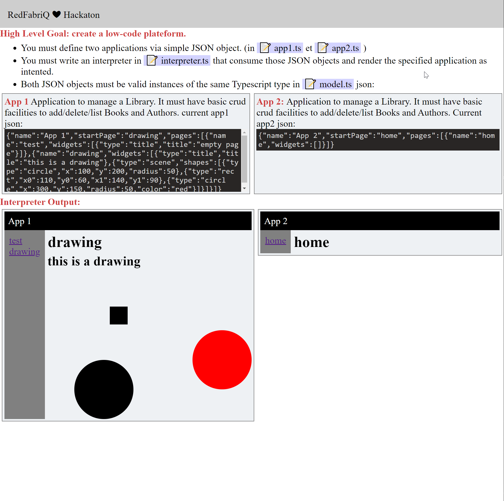

# RedFabriQ :heart: Challenge

**Context**: [RedFabriQ](https://www.redfabriq.com/en/index.html)  is a French startup-studio with a software & hardware culture. Among the projects that RedFabriQ are promoting are related to what is referred to as low-code platforms.

Low-code development platform is an application that provides the Graphical User Interface for programming and thereby develops the code at a very fast rate & reduces the traditional programming efforts.

**Goal**: RedFabriQ challange aims studying the foundations of a low-code platform by consdiring two main dimensions in the context of web-developement:

-   What are the relevant abstractions needed to implement web applications?
-   How to implement the interpreter needed to execute the abstraction and generate the code of the web application?

**For the experiment we will intend to provide:**


- We will provide examples of  `react`  applications with their models.
- We will provide an example of interpreter that automatically generate the apps from the initial models.
- An engine to execute the interprer and visualize the web applications on the browser. 
  
**We expect:**

Inspiring  by the provides apps, models and interpreter, we except thay you propose new models and interpreters to implement two new simple applications.


---

## Instructions

### 1. clone this repository.

It contains a simple `react` application (created with `create-react-app`) that uses `mobx` for its state management

### 2. Start the application

with

```shell
npm start
```

you'll see instructions open a new web page like this:

